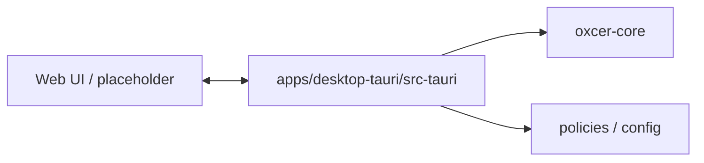

# Desktop Tauri app

Cross-platform desktop backend (Tauri v2) for Oxcer. Backend only; minimal WebView placeholder. Primary UI on macOS is the SwiftUI launcher.

## Architecture

- **Web UI** → built to `dist/` (minimal shell); talks to **src-tauri** via Tauri IPC.
- **src-tauri** → Rust backend; calls **oxcer-core** and loads **policies/config**.

See repo root [README](../../README.md) and [docs/DEVELOPMENT.md](../../docs/DEVELOPMENT.md) for building and running (`pnpm tauri dev` from repo root).
